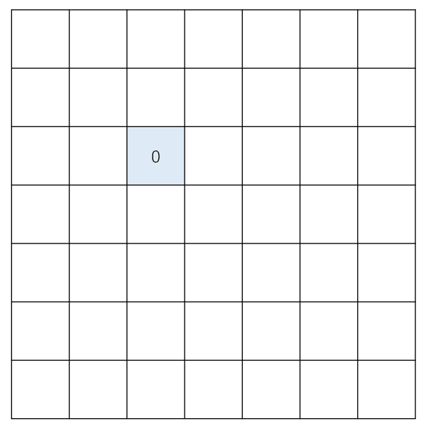

# Chapter 3. BFS

### 引导问题

在进行本章的学习前，请先思考如下的问题：

你将面对一个有限的数轴，范围\[1, 10000\]，最开始你的手指指在一个数字 x 上，现在你需要移动你的手指使之最终指在数字 y 上。每次你可以选择将手指移动到以下任何一处：x = x + 1；x = x - 1；x = x \* 2；x = x // 2。**你不能将手指移出数轴的表示范围。**你必须尽可能少的移动手指，你的答案应该输出最少移动手指的次数（当 x == y 的时候，你应该输出 0）。

例：x = 3, y = 7 时，你应该输出 2，因为 3 \* 2 + 1 = 7，并且你无法找到任何比两次移动更少的方案。

**如果你完全不知道 BFS 算法的任何知识，请至少花费五分钟来思考你能想到的解法。**

### 理论篇

在理解 BFS 的流程之前，不妨先从名称剖析这个算法：

* S：即搜索，“搜索算法”是一种**无目的的、盲目的**算法，换句话说，算法本身不考虑所寻找的目标是否真的存在，但是只要找到了所有的可能（彻底寻找整个图），就能判断所寻找的目标是否存在。
* BF：即宽度优先、广度优先，是一种对搜索策略的描述，与之类似的还有“深度优先”，关于“深度优先”，此处不做过多讨论。宽度优先指的是一种**记录所有可能的第一步的位置，然后依次寻找这些位置并进入第二步的位置，然后以此类推，直到所有可能都被找到（彻底寻找整个图）才停下**的策略。值得注意的是，在部分情况下，不一定需要将所有可能都找到，只需要找到任何一种可能即可。如果将所需步数相等的位置进行记录，则能看到一种类似于“涟漪”的传播方式（搜索过的格子不会二次搜索），下面的动图展示了矩阵中 BFS 的搜索过程：



### 逻辑篇

BFS，是 Breath First Search 的缩写，中文名称为“宽度优先搜索”，亦称“广度优先搜索”。是一个基础且经典的图论算法，在很多高级图论算法中都或多或少的有 BFS 的影子，例如 Dijkstra，Prim，SPFA 等。

在上文中介绍了 BFS 算法的名称以及含义，下面将进行算法逻辑的介绍：

1. 获得搜索起点并记录起点，将起点加入队列
2. 从队列中取出队首，找到所有队首能走到的下一步的位置集合
3. 如果集合中的一个位置没有被记录过，则入队该位置，并将当前位置记录
4. 重复进行 2 - 3 步，直到满足结束条件或者彻底搜索完毕（队列空）

**Q1：为什么选择队列？**

A1：首先先回顾下“宽度优先”策略，其中提到过一个关键词：依次寻找。所谓依次寻找，指的是假设第一步可以走到 3 个位置（假设这三个位置叫做 x0, x1, x2），但实际上，这三个位置能走到的第二步不是立刻得出的，是依次执行的，这样便会出现一个问题：假设通过 x0 又能找到三个位置（假设这三个位置叫做 y0, y1, y2），那么此时容器内共有两类数据，一类是 x，一类是 y（换句话说，一类是第一步的位置，一类是第二步的位置）。如果上述所使用的容器中既含有第一步的信息，有含有第二步的信息（容器内部无序），就无法保证“依次”这个特征。在此处有两种解决方案：1、使用多个容器；2、使用有序的容器。在这里，本节的逻辑使用第二种解决方案（使用有序的容器），第一种解决方案将在**拓展知识**中进行介绍：要注意的是此处的“有序”，指的是找到的顺序（先找到的数据先执行，后找到的数据后执行），并不是有序数组中的“有序”。所以在 BFS 中，基于队列的实现方式是一种最为普遍的实现方式。

**Q2：如何实现记录走过的位置？**

A2：可以用于记录的容器有很多，例如 list，dict，set 等等，每种容器都有各自适合的场景。但是在 BFS 中，不仅要记住所有出现过的位置，还要及时判断某个位置是否已经被访问过。那么使用 set/dict 往往是更优秀的实现方式，因为 set/dict 可以在常数级别的时间内进行判断，而 list 最坏的情况则会达到线性级。

### 实现篇

BFS 伪代码如下：

```python
# 记录起点
visited = set([start]) or visited = {start : 0}
# 起点入队
queue.push(start)
​
# 循环出队
while queue:
    # 得到当前点
    node = queue.pop
    # 得到当前点能走到的所有点
    next_nodes = get_next_nodes(top)
    # 遍历这些点
    for next_node in next_nodes:
        # 只要没有搜索过的，搜索过的点就不搜二次了
        # 可能出现没搜过但是不合法的点，也不能搜索
        if next_node in visited or next_node is invalid:
            continue
        # 记录新点
        visited.add(next_node) or visited[next_node] = visited[node] + 1
        # 新点入队
        queue.push(next_node)
```

在 while 循环结束后，往往有以下两种返回方式：

1、返回能不能从起点走到终点：

```python
return end in visited
```

2、返回从起点到终点最少走多少步（起点走不到终点返回 -1）：

```python
return visited[end] if end in visited else -1
```

**Tips：**

**1、从第二种返回方式可以看出，如果需要知道步数，则负责记录的容器一定要选择 dict，否则 set/dict 均可。**

**2、如果 visited 使用 dict 来实现，则其意义为：从 start 走到 point 时，所耗费的步数为 visited\[point\]。**

**3、只判断能不能走到终点的问题被称为“连通性问题”，而求最少步数的问题被称为“最短路问题”。**

**4、Python 中基于 list 的 queue 效率不高，建议使用 collections 中的 deque 来实现 queue。**

### 解题篇

下面将对上述引导题目进行求解，为方便阅读，将原题目复制在这里：

你将面对一个有限的数轴，范围\[1, 10000\]，最开始你的手指指在一个数字 x 上，现在你需要移动你的手指使之最终指在数字 y 上。每次你可以选择将手指移动到以下任何一处：x = x + 1；x = x - 1；x = x \* 2；x = x // 2。**你不能将手指移出数轴的表示范围。**你必须尽可能少的移动手指，你的答案应该输出最少移动手指的次数（当 x == y 的时候，你应该输出 0）。

通过刚才的学习，可以知道，本题属于最短路问题（需要记录最少的移动次数），所以需要使用 dict 进行记录。

分析题目：起点是 x，终点是 y，每个点最多能走到 4 个位置（x + 1、x - 1、x \* 2、x // 2）。

解题代码如下：

```python
import collections
​
def minimum_steps(start, end):
    # 记录起点
    visited = {start : 0}
    # 起点入队
    queue = collections.deque([start])
​
    # 循环出队
    while queue:
        # 得到当前点
        node = queue.popleft()
        # 得到当前点能走到的所有点
        next_nodes = [node + 1, node - 1, node * 2, node // 2]
        # 遍历这些点
        for next_node in next_nodes:
            # 只要没有搜索过的，搜索过的点就不搜二次了
            # 题目说了数轴范围是 [1, 10000]，因此越界的数字是要被排除掉的
            if next_node in visited or next_node < 1 or next_node > 10000:
                continue
            # 记录新点
            visited[next_node] = visited[node] + 1
            # 新点入队
            queue.append(next_node)
​
    return visited[end] if end in visited else -1
​
if __name__ == "__main__":
    print(minimum_steps(3, 7))
​
```

### 习题篇

#### 机器人走迷宫

在一个 n \* m 的迷宫中，有一个机器人将从左上角出发，在迷宫中有一些障碍，机器人无法通过，你的任务是判断机器人能否从迷宫的左上角走到右下角。迷宫中的障碍以 1 表示，非障碍则以 0 表示，示例如下：

```python
# input
n = 2, m = 5
maze = [
[0, 0, 0, 1, 1], 
[0, 1, 0, 0, 0]
]

# output
True
```

```python
# input
n = 2, m = 5
maze = [
[0, 1, 0, 1, 1], 
[0, 1, 0, 0, 0]
]

# output
False
```

#### 数字变换

你将得到一个**三位数** x，你的目标是将 x 变成另一个数字 y，每次变化你可以将 x 的任意一个数位变成 0-9 任意一个数字，但是每次变化后，新的 x 必须是一个**不包括前导零**的质数，例如：你不可以将 "103" 变化为 "003"，但你可以将 "103" 变为 "101"。保证输入 x 和 y 都是质数，并且 100 &lt;= x, y &lt;= 999。（当 x == y 的时候，你应该输出 0）

你可以使用如下函数判断一个数是不是质数：

```python
def is_prime(x):
    if x <= 1:
        return False
    if x == 2:
        return True
    for i in range(2, x):
        if i * i > x:
            break
        if x % i == 0:
            return False
    return True
```

输入：

x = 103, y = 823

输出：

3

解释：

103 -&gt; 503 -&gt; 523 -&gt; 823，方案可能不止一种，但是最少需要的步数是 3。

### 拓展知识【留坑】

