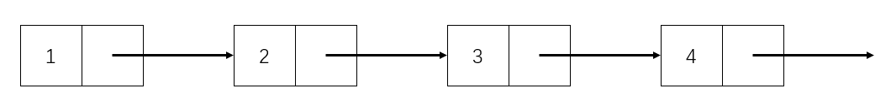
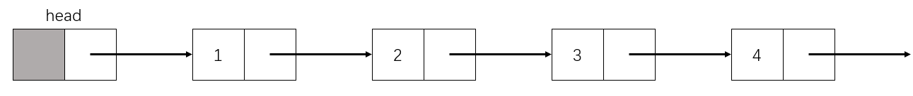

# Chapter D2. Linkedlist

### 理论篇

链表，也可简称单链表，英文为LinkedList，是一种常见的线性数据结构。

顾名思义，链表在计算机中是以一种链式形态进行存储的，构成它的单元被称作“节点”。与数组不同，链表所开辟的内存空间是不连续的，通过一根指针将一个节点指向另一个节点，形如一条锁链，如下图：



从上图不难看出，链表的每个节点具有两个属性，其一为每个点的值（称为 value），另一个则是所指向其他节点的地址（称为 next），而最后一个节点指向的是空，也就是 None。

但是在实际使用中，往往会让链表在第一个节点之前放一个无意义的节点，该节点被称为“头节点”，如下：



头节点的值是没有意义的，所以在上图中没有给出，实际使用的时候随意赋值就可以。

有关于头节点的优点将放在**实现篇**中进行介绍。

### 实现篇

在学习数据结构类的问题时，一定要学习它的各种操作。

链表的常见操作有创建、遍历、更新指定节点的值，在尾端插入节点，在给定位置插入节点，删除给定位置的节点等等。

#### 链表的创建

上文说过，链表由节点构成，并且每个节点具有两种属性（值 value 和下一个节点 next），那么链表节点的类可以如下定义：

```python
class ListNode:
	def __init__(self, val):
		self.val = val
		self.next = None
```

在创建链表时，只需要声明新的 ListNode 对象后，再修改他们的 next 属性即可。

```text
head = ListNode(0) # head.val 无意义，此处可随意赋值
node1 = ListNode(1)
node2 = ListNode(2)
node3 = ListNode(3)
node4 = ListNode(4)

head.next = node1
node1.next = node2
node2.next = node3
node3.next = node4
```

#### 链表的遍历

所谓遍历，就是一种按照特有策略访问某种数据结构或某种容器的顺序，做到每个元素仅且必须访问一次。链表的遍历一般从链表的第一个节点开始，沿着 next 指针进行访问。值得注意的是，由于本篇教程使用了“头节点”这个无意义的节点，因此在遍历链表的时候，头节点是不被访问的。

```python
def traverse(head):
    result = []
    node = head.next # 跳过头节点
    while node.next:
        result.append(str(node.val))
        node = node.next
    result.append(str(node.val)) # 不要忘记最后的节点值没加进列表

    return result

print(" -> ".join(traverse(head)))
```

由于链表的特性，在很多链表的操作都可以使用递归来写，但是本人不是十分推崇，虽然代码量有所节省，实现相对简单，但是如果链表很长，加之不进行递归深度的设置，很容易出现栈溢出的问题。

下面为递归实现的链表遍历：

```python
def traverse_r(node, result):
    if not node.next:
        result.append(str(node.val))
        return
    traverse_r(node.next, result)
    result.append(str(node.val))

result = []
traverse_r(head.next, result)
result.reverse()
print(" -> ".join(result))
```

### 练习篇


