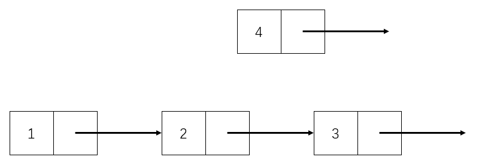

# Chapter D2. Linkedlist

### 理论篇

链表，也可简称单链表，英文为LinkedList，是一种常见的线性数据结构。

顾名思义，链表在计算机中是以一种链式形态进行存储的，构成它的单元被称作“节点”。与数组不同，链表所开辟的内存空间是不连续的，通过一根指针将一个节点指向另一个节点，形如一条锁链，如下图：


从上图不难看出，链表的每个节点具有两个属性，其一为每个点的值（称为 value），另一个则是所指向其他节点的地址（称为 next），而最后一个节点指向的是空，也就是 None。

但是在实际使用中，往往会让链表的头节点（头节点：链表的第一个节点）之前放一个无意义的节点，该节点被称为“虚头节点”，如下图：


虚头节点的值是没有意义的，所以在上图中没有给出，实际使用的时候随意赋值就可以。

**注：实现篇的所有实例均使用了虚头节点。**

### 实现篇

在学习数据结构类的问题时，一定要学习它的各种操作。

链表的常见操作有创建、遍历、更新指定节点的值，在尾端插入节点，在给定位置插入节点，删除给定位置的节点等等。

#### 链表的创建

上文说过，链表由节点构成，并且每个节点具有两种属性（值 val 和下一个节点 next），所以链表节点的类一般如下定义：

```python
class ListNode:
	def __init__(self, val):
		self.val = val
		self.next = None
```

在创建链表时，只需要声明新的 ListNode 对象后，再修改他们的 next 属性即可。

```python
head = ListNode(0) # head.val 无意义，此处可随意赋值
node1 = ListNode(1)
node2 = ListNode(2)
node3 = ListNode(3)
node4 = ListNode(4)

head.next = node1
node1.next = node2
node2.next = node3
node3.next = node4
```

#### 链表的遍历

所谓遍历，就是一种按照特有策略访问某种数据结构或某种容器的顺序，做到每个元素仅且必须访问一次。链表的遍历一般从链表的第一个节点开始，沿着 next 指针进行访问。值得注意的是，由于本篇教程使用了“虚头节点”这个无意义的节点，因此在遍历链表的时候，虚头节点是不能被访问的。

```python
def traverse(head):
    result = []
    node = head.next # 跳过虚头节点
    while node.next:
        result.append(str(node.val))
        node = node.next
    result.append(str(node.val)) # 不要忘记最后的节点值没加进列表

    return result

print(" -> ".join(traverse(head)))
```

由于链表的特性，在很多链表的操作都可以使用递归来写，但是本人不是十分推崇，虽然代码量有所节省，实现相对简单，但是如果链表很长，加之不进行递归深度的设置，很容易出现栈溢出的问题。

下面为递归实现的链表遍历：

```python
def traverse_r(node, result):
    if not node.next:
        result.append(str(node.val))
        return
    traverse_r(node.next, result)
    result.append(str(node.val))

result = []
traverse_r(head.next, result)
result.reverse()
print(" -> ".join(result))
```

链表的遍历是基础中的基础，基本所有链表的操作都是基于遍历实现的，尤其是使用 while 的遍历，一定要深入理解。而且不仅仅是链表，在后续的其他数据结构（比如字典树）中，也会看到与链表遍历类似的代码，这种通过 next 属性进行链式访问的思想也是极为重要的。

#### 链表的修改

链表的修改实质上就是在遍历的过程中进行 node.val 的更新。

一般链表的修改有两种：其一是按位置更新，第二则是按值更新，按位置更新的示例如下：

```python
# 把虚头节点为 head 的链表的第 index 个节点的值修改为 new_val
def update_by_index(head, index, new_val):
    # 跳过虚头节点
    node = head.next
    cnt = 1
    while node.next and cnt != index:
        node = node.next
        cnt += 1
    
    # 如果链表遍历完了 cnt 还不等于 index，说明链表不够长
    if cnt != index:
        return False
    
    # 直接修改 val 即可
    node.val = new_val
    return True
    
# 调用与比较
# 原链表为 1 -> 2 -> 3 -> 4
print(" -> ".join(traverse(head)))s
# 把第二个节点的值改为 new_val
update_by_index(head, 2, 5)
# 新链表为 1 -> 5 -> 3 -> 4
print(" -> ".join(traverse(head)))
```


#### 链表的插入

链表的插入一般分为两种，其一为“尾插”，也就是在整个链表的尾部插入一个新的节点；其二为“指定位置的插入”，比如“在链表的第三个节点后面插入一个新的节点”等等。

链表的尾插基本和遍历所差无几，通过遍历找到最后一个点，然后将该节点的 next 指向新的链表节点就可以了：

```python
# 在虚头节点为 head 的链表的尾部插入一个值为 val 的节点
def insert_to_tail(head, val):
    node = head
    while node.next:
        node = node.next
    node.next = ListNode(val)
    
# 调用与比较
# 原链表为 1 -> 2 -> 3 -> 4
print(" -> ".join(traverse(head)))
# 在链表尾部插入值为 5 的节点
insert_to_tail(head, 5)
# 新链表为 1 -> 2 -> 3 -> 4 -> 5
print(" -> ".join(traverse(head)))
```

在指定位置插入节点相对复杂，并且也涉及到一个在链表的操作中非常容易出现的错误：**链表的丢失**。

因为在链表中，想得到链表中的某个节点，只能通过它的前驱节点得到（若 node1.next = node2，则称 node1 为 node2 的**前驱节点**，也称 node2 为 node1 的**后继节点**），如果操作顺序不当，会导致某一段链表失去前驱节点，那么这一段链表就彻底找不到了，错误演示如下（将 1 -&gt; 2 -&gt; 3 变成 1 -&gt; 2 -&gt; 4 -&gt; 3）：


错误演示中存在的最大问题便是没有先把节点 3 记录下来，这就导致了在更改了节点 3 的前驱节点（即节点 2）的指向后，节点 3 及其后面的链表全部丢失。所以正确的做法是先将节点 3 记录下来，最简单有效的办法是先将节点 4 的 next 指向节点 3，然后再修改节点 2 的 next 就规避了错误，演示如下：



此种插入方法的实现同样是基于遍历，由于知道链表插入的位置，所以需要额外设置一个计数器：

```python
# 在虚头节点为 head 的链表的第 index 个节点后面插入一个值为 new_val 的节点
def insert_by_index(head, index, new_val):
    # 跳过虚头节点，如果不写这行的话可以把 cnt 初始化为 0
    node = head.next
    cnt = 1
    while node.next and cnt != index:
        node = node.next
        cnt += 1
    
    # 如果链表遍历完了 cnt 还不等于 index，说明链表不够长
    if cnt != index:
        return False
    
    # 一定要记住：先修改新节点的 next
    new_node = ListNode(new_val)
    new_node.next = node.next
    node.next = new_node
    
    return True
    

# 调用与比较
# 原链表为 1 -> 2 -> 3 -> 4
print(" -> ".join(traverse(head)))
# 在第 3 个节点后面插入值为 5 的节点
insert_by_index(head, 3, 5)
# 新链表为 1 -> 2 -> 3 -> 5 -> 4
print(" -> ".join(traverse(head)))
```

同样，链表的插入也有按值插入：在遇到的第一个特定值的节点后插入。实现如下：

```python
# 在虚头节点为 head 的链表的第一个值为 val 的节点后面插入一个值为 new_val 的节点
def insert_by_value(head, val, new_val):
    # 跳过虚头节点，如果不写这行的话虚头节点的值一定不要等于 val
    node = head.next
    while node.next and node.val != val:
        node = node.next

    # 遍历结束都没找到 val 就代表链表里没有符合插入的位置
    if node.val != val:
        return False
    
    # 一定要记住：先修改新节点的 next
    new_node = ListNode(new_val)
    new_node.next = node.next
    node.next = new_node
    
    return True


# 调用与比较
# 原链表为 1 -> 2 -> 3 -> 4
print(" -> ".join(traverse(head)))
# 在第一个值为 2 的节点后面插入值为 5 的节点
insert_by_value(head, 2, 5)
# 新链表为 1 -> 2 -> 5 -> 3 -> 4
print(" -> ".join(traverse(head)))
```

当然，链表插入的方式还有很多，毕竟题都是人出的。比如在前两个节点后各插入一个新节点，在偶数节点后面插入，在所有特定值节点后插入等等。虽然看似天花乱坠，实则都是基于以上两种插入方式实现（**按特定位置插入**以及**按特定值插入**），在学习时应举一反三，尝试自己实现多种插入方式。

#### 链表的删除

### 练习篇


